# git 操作
* 1、git init 初始化一个仓库s
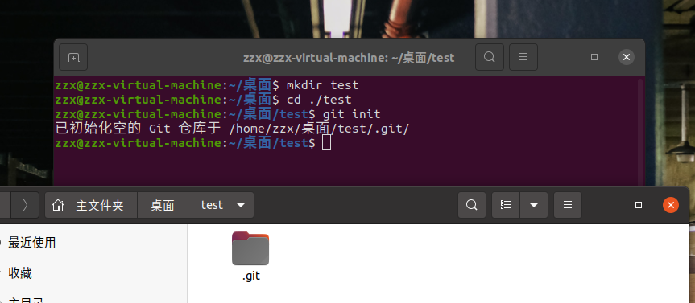

* 2、git创建仓库之后需要设置个人信息
git config --global user.name "用户名"
git config --global user.email "邮箱"
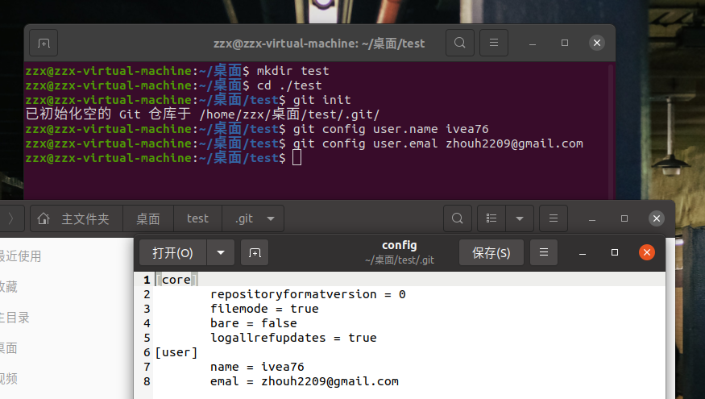
* 3、git status 查看仓库状态
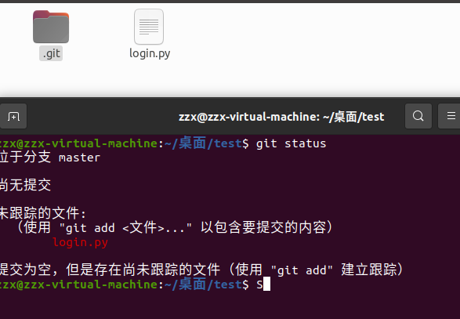
* 4、git add 文件名 添加文件到暂存区
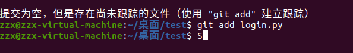
* 5、git commit -m "提交说明" 提交文件到仓库
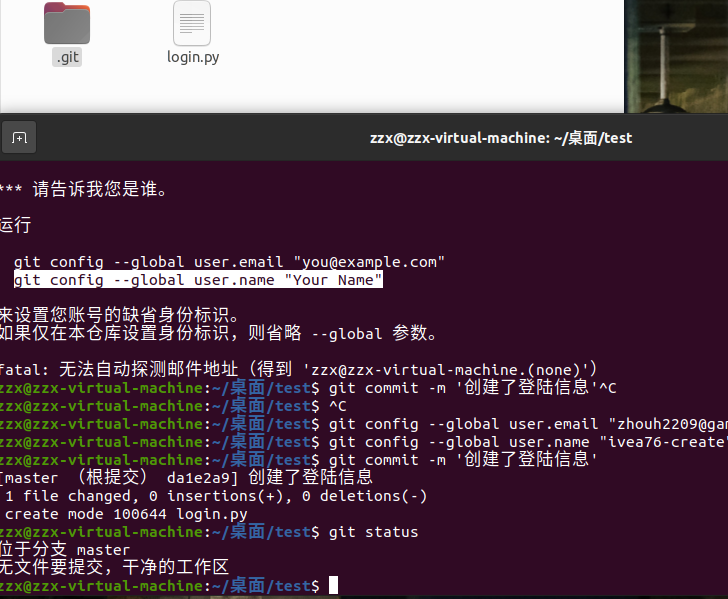
* 6、git log 查看提交历史  上述操作用于
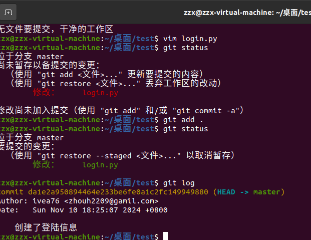
* 7、git reset --hard HEAD^ 回退到上一个版本
* 8、git reset --hard HEAD^^ 回退到上上一个版本
* 9、git reflog 查看命令历史
* 10、git reset --hard 版本号 回退到指定版本
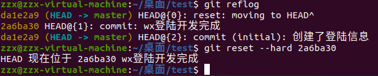

* 11、git reset HEAD 文件名 取消暂存区文件 由绿色变红色
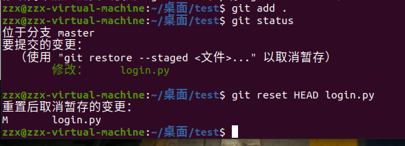
* 12、git checkout -- 文件名 丢弃工作区文件 变成未暂存区文件
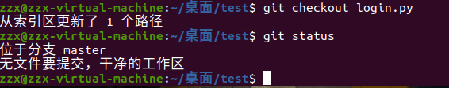
* 13、git clone 仓库地址 克隆一个仓库
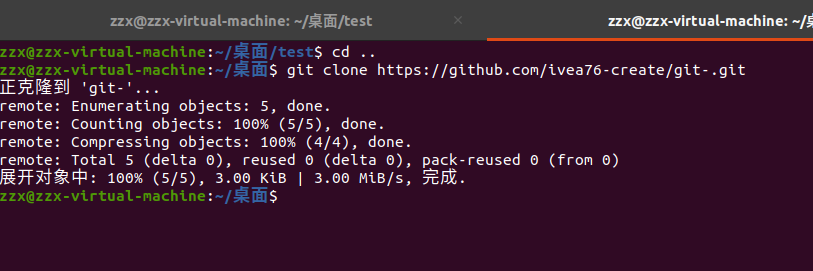
## 常用命令
* 1、git status 查看仓库状态
* 2、git add 文件名 添加文件到暂存区
* 3、git commit -m "提交说明" 提交文件到仓库
* 4、git push 推送到远程仓库
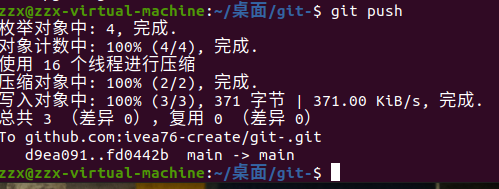
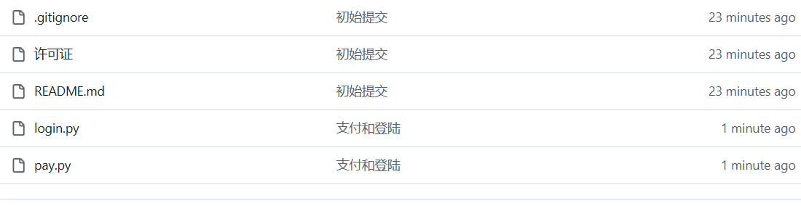
* 5、git pull 取回远程仓库的更新
## 密钥问题
* 1、检查本地主机是否已经存在ssh key
cd ~/.ssh
ls
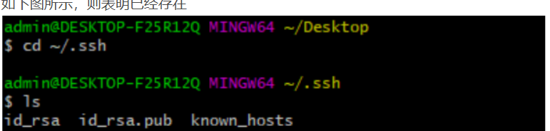
* 2、如果没有，生成ssh key
ssh-keygen -t rsa -C "zhouh2209@gmail.com"
执行后一直回车即可
* 3、获取ssh key公钥内容
cd ~/.ssh
cat id_rsa.pub
* 4、复制公钥内容

* 5、在Github账号上添加公钥
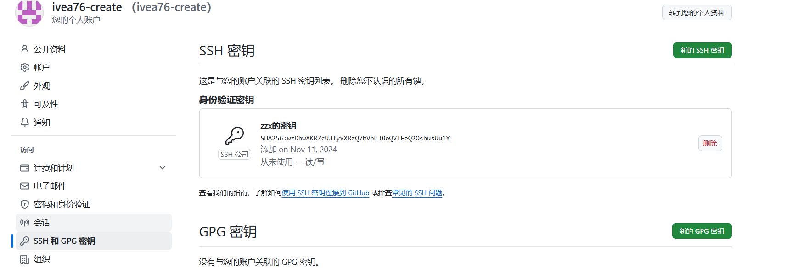
* 6、验证是否设置成功
ssh -T git@github.com
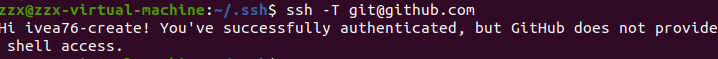
## 配置连接问题
* 1、配置远程仓库地址
git remote add origin git@github.com:ivea76-create/py3_django.git
* 2、验证远程仓库配置
git remote -v
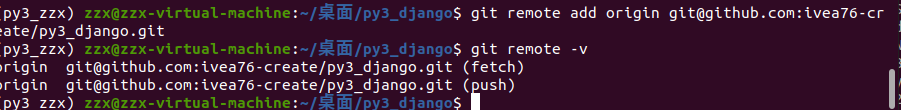
* 3、执行推送操作
git push 
* 4、推送到master分支
git push origin master
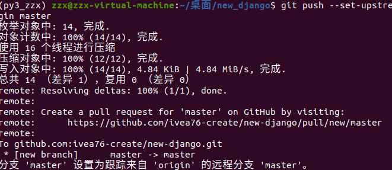
