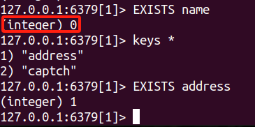

# redis操作指令
## redis-cli启动
* 1、redis-cli启动redis
* 2、select 1 切换数据库
* 3、redis数据类型为str dict(hash) list sets sorted sets(有序集合)
* 4、redis是key value结构，每条数据都是键值对，键的类型为字符串，键不能重复
## str指令
* 1、set key value 设置key-value
* 2、get key 获取key-value
* 3、setex key 设置过期时间，参考验证码过期
* 4、ttl 查看key过期时间 类似验证码倒计时

* 5、keys * 查看所有键
* 6、exists key 判断key是否存在

* 7、type key 查看key类型

* 8、mset key1 value1 key2 value2 批量设置key-value
例如 mset address "北京市海淀区" phone "13800138000"

* 9、mget key1 key2 批量获取key-value
例如 mget address phone
* 10、设置过期时间expire
例如 expire phone 10

* 11、ttl phone 查看phone的过期时间
* 12、del key 删除key

## hash命令
* 1、hset person name itcast 设置person下name键的值
* 2、hset person age 15 设置person下age键的值

* 3、hget person name 获取person下name键的值
* 4、hget person age 获取person下age键的值

* 5、hmset person name itcast age 15 批量设置hash(包含m)

* 6、hmget person name age 批量获取hash(包含m)
* 7、hkeys person 查看person下所有键

* 8、hvals person 查看person下所有值

* 9、hdel person name 删除person下name键

* 10、hset person age 20 更新person下age键的值

## list命令
* 1、lpush list1 a b c 向list1左侧插入元素(顺序是推着走的)

* 2、lrange list1 0 -1 取出list1所有元素(0是从头开始,-1是从最后一个开始)
类似浏览记录，最新浏览的在最前面

* 3、rpush list1 666  # 从右侧插入元素
* 4、lrange list1 0 -1 取出list1所有元素

* 5、lrem list1 0 a 
  删除list1第一个a元素(0代表全删除，1删一个，2删两个，-1代表从右边删除，-2删两个，-3删三个)

## set命令

* 1、sadd class china
* 2、sadd class usa
* 3、smembers class 取出class集合所有元素

特点：set集合不重复，无顺序
* 4、srem class usa 移除class集合中的usa元素

## zset有序集合命令
* 1、zadd dashuju 100 zzx-100
以大数据考试分数为例，分数为100，姓名为zzx-100

* 2、zrange dashuju 0 -1
取出dashuju集合所有元素 0是从头开始 -1是从最后一个开始

## pycharm 创建redis连接

from redis import Redis
r = Redis(host='localhost', port=6379, db=0)
r.set('mingzi', 'itcast')
run

1、导包 2、创建指令 3、执行指令 set、get、 delete
4、redis-cli 进入redis命令行 
5、select 1 切换数据库 6、keys * 查看所有键 7、type key 查看key类型 
8、mset key1 value1 key2 value2 批量设置key-value 
9、mget key1 key2 批量获取key-value 
10、expire key 10 设置过期时间 
11、ttl key 查看key的过期时间 
12、del key 删除key 
13、hset key field value 设置hash 
14、hget key field 获取hash 
15、hmset key field1 value1 field2 value2 批量设置hash 
16、hmget key field1 field2 批量获取hash 
17、hkeys key 获取hash所有键 
18、hvals key 获取hash所有值 
19、hdel key field 删除hash 
20、lpush key value向list左侧插入元素 
21、lrange key start stop 取出list所有元素 
22、rpush key value 从右侧插入元素 
23、lrem key count value 删除list元素 
24、sadd key member 向set集合添加元素 
25、smembers key 取出set集合所有元素 
26、srem key member 移除set集合中的元素 
27、zadd key score member 向有序集合添加元素 
28、zrange key start stop 取出有序集合所有元素 
29、zrem key member 移除有序集合中的元素 
30、zrangebyscore key min max 取出有序集合中指定分数范围的元素 
31、zremrangebyscore key min max 移除有序集合中指定分数范围的元素
32、zcard key 取出有序集合元素个数