# web框架
## 核心：请求，相应，业务逻辑
* 1、业务逻辑
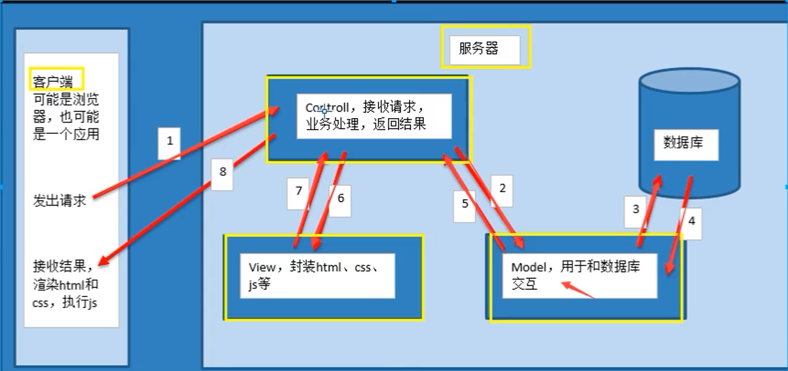
* 2、mvt模式
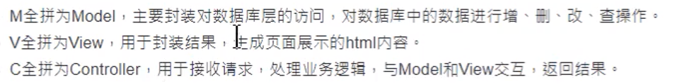
m model 用于数据库交互，数据库增删改查
t template 负责封装js,html ,css
v view  负责业务逻辑层 接收请求，返回结果
## 虚拟环境创建
* 1、安装virtualenvwrapper
* mkdir ~/.virtualenvs
* 2、设置环境变量
sudo vim ~/.bashrc

* 3、配置环境变量（在vim ~/.bashrc下）
export WORKON_HOME=$HOME/.virtualenvs
source /usr/local/bin/virtualenvwrapper.sh

* 4、保存后运行 wq
source ~/.bashrc
* 5、创建虚拟环境
mkvirtualenv -p python3 myenv
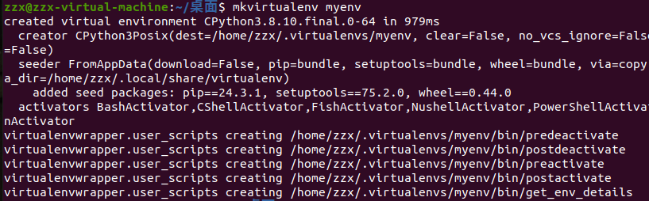
* 6、列出虚拟环境
lsvirtualenv

* 7、激活虚拟环境
workon myenv
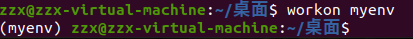
* 8、退出虚拟环境
deactivate
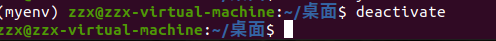
* 9、进入虚拟环境之后安装虚拟环境库
pip install requests
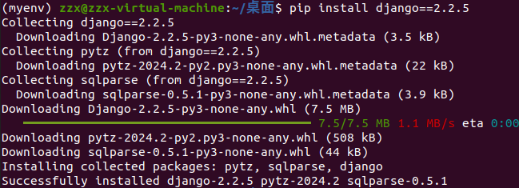
* 10、创建py3_zzx虚拟环境
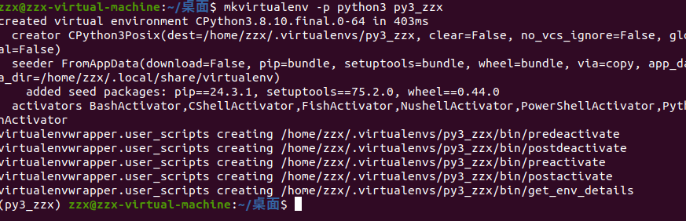
* 11、列出虚拟环境
lsvirtualenv
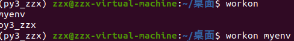
* 12、切换虚拟环境
workon py3_zzx

* 13、删除虚拟环境
rmvirtualenv myenv
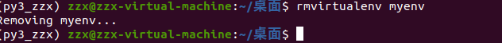
* 14、删除py3虚拟环境下列出安装的库
pip list
* 15、创建第一个django项目
django-admin startproject bookmanager
* 16、进入项目目录
cd bookmanager
* 17、tree
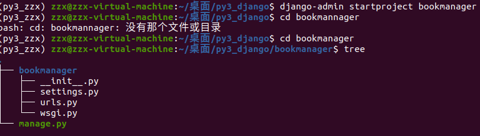
* 18、配置文件详解
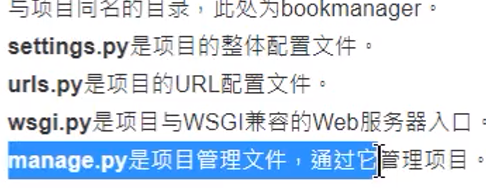
* 19、运行manage.py
python manage.py runserver
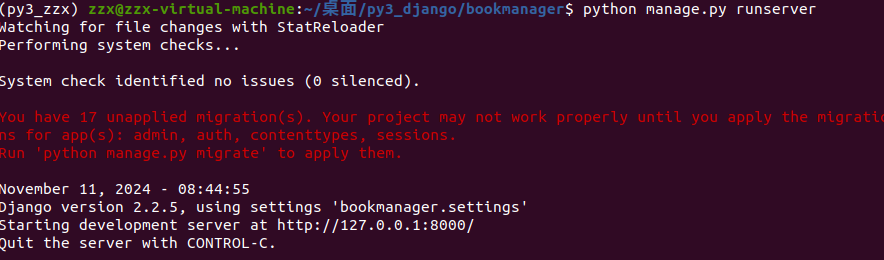
* 20、success!
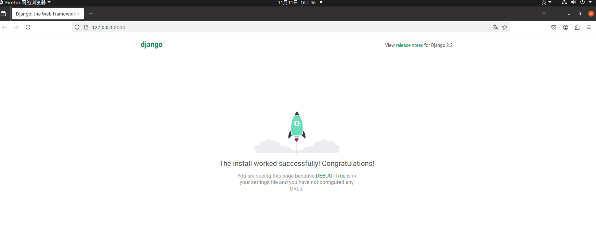
* 21、注意事项
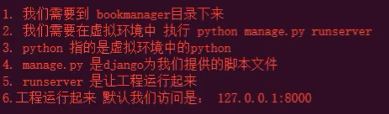
* 22、创建子应用
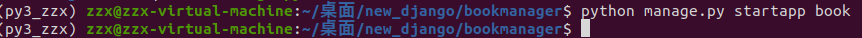
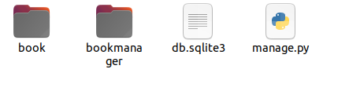
* 23、层级关系
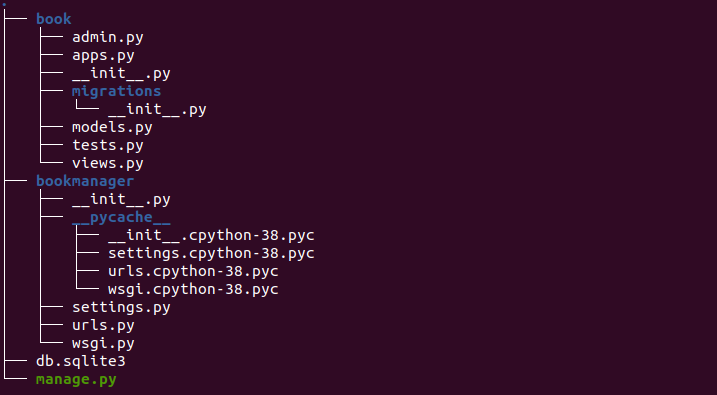
* 24、MVT设计模式主要用view 和 model 
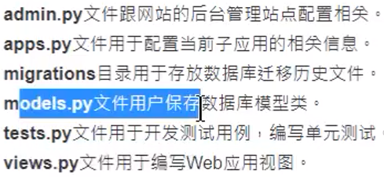
* 25、ORM模型可以操作各种关系型数据库，可以转换为特定数据库的insert、update、delete语句，当数据库返回数据集时，再转换为python中的列表
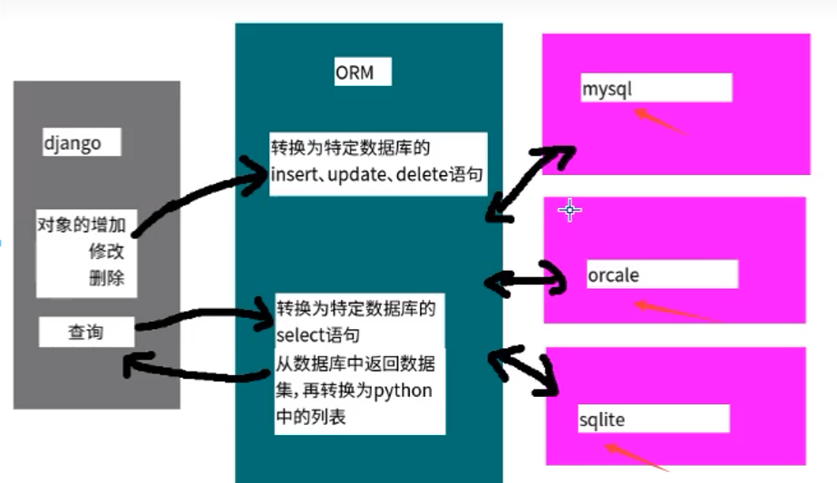
* 26、MVT设计模式中的model内嵌了orm模型（面向对象）所以需要定义模型类，完成数据库增删改查关系对应
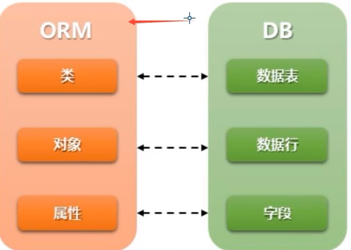
类对应数据表，对象对应数据行，属性对应字段

