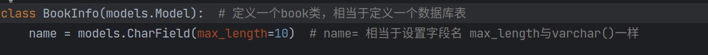
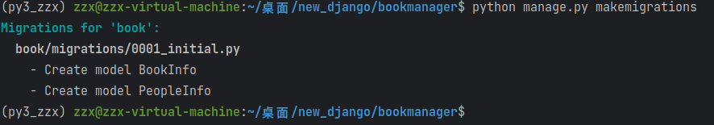
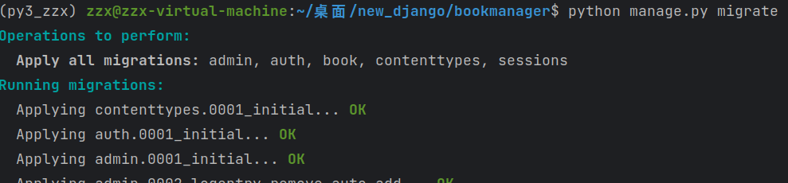
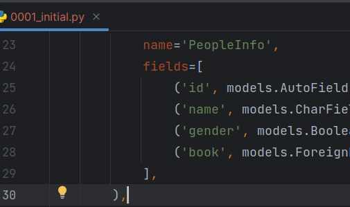
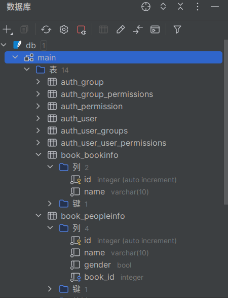

图书系统开发流程
一、类对应数据表，对象对应数据行，属性对应字段
1、定义一个BookInfo类，对应数据表创建表（注意使用骆驼命名法）（需要注意继承类）

name：书名 max_length=10代表与数据库字段类型一致，max_length=100代表数据库字段长度为100
二、迁移模型
生成迁移文件（将类转换为表结构）
python manage.py makemigrations

执行迁移文件
python manage.py migrate

生成文件001

查看数据
