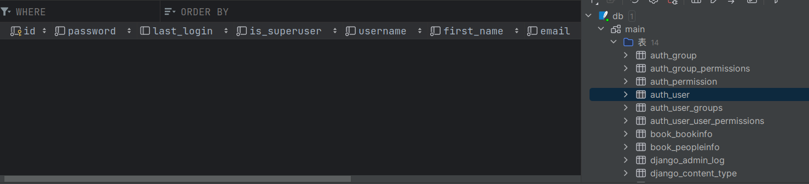
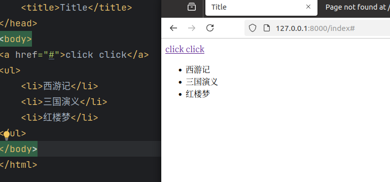

# 图书系统开发流程
## 一、类对应数据表，对象对应数据行，属性对应字段
* 1、定义一个BookInfo类，对应数据表创建表（注意使用骆驼命名法）（需要注意继承类）
* 2、name：书名 max_length=10代表与数据库字段类型一致，max_length=100代表数据库字段长度为100

 

## 二、迁移模型
* 1、生成迁移文件（将类转换为表结构）
'python manage.py makemigrations'

* 2、执行迁移文件
'python manage.py migrate'

* 3、生成文件001

* 4、移动到数据库中查看数据

## 站点管理（实现数据库增删改查）
1、管理界面本地化
2、创建管理员
3、注册模型类
4、发布内容到数据库

#### 一、本地化管理

* 1、URL后缀添加admin进入站点管理

* 2、在settings.py文件中修改语言

#### 二、创建管理员

* 1、auth_user表中设置登录密码

* 2、'python manage.py createsuperuser'
创建管理员账号

#### 三、注册模型类

* 1、在admin.py中注册模型类

导包
'from book.models import BookInfo, PeopleInfo'
注册模型类
'admin.site.register(BookInfo)'
'admin.site.register(PeopleInfo)'
需重启Django服务

#### 四、发布内容到数据库

* 1、要显示name,需要调用str方法返回实例对象
'return self.name'

## 视图

发出请求到路由，路由匹配到视图，视图处理请求，到数据库拿数据，返回给视图，视图给templates渲染，返回视图，视图最终返回给客户端

## 路由
* 1、能允许访问的URL在urls.py中定义

* 2、配置路由需要先导入视图函数
'from book.views import index'
然后配置path路径

* 3、ok

* 4、配置子应用路由
'def hi(request):
    return HttpResponse("hi")'

## 匹配关系

#### 请求——>匹配——>视图——>响应

## 路由匹配2

* 1、用blog/方式匹配子应用路由

* 2、指向子应用urls.py，指向后通过blog/匹配子应用路由

#### 用于在子应用多的时候(模块功能多)汇总去匹配总路由(小组长收作业给老师)

## template模块的使用

* 1、创建模板文件，在同级目录下创建，templates文件夹，在settings.py中配置

* 2、在settings.py中配置模板路径

* 3、配置路由返回参数

* 4、返回render函数，参数为模板路径和参数(返回的数据用html模板展示所以需要返回渲染的html页面)

#### 遇到的问题：bookmanager下的原来的blog/必须设置为空，才能确保正确匹配到子应用的路由(因为子应用的路由为inndex)，他的视图返回index.html

* 5、在templates文件夹下创建index.html文件，通过ul标签,li标签渲染数据，完成基本前端页面的展示

## 动态页面

* 1、为了确保html页面文字可以动态展示，需要定义一个context字典，将数据以键值对的形式传递给模板

* 2、并在模板中通过{{}}获取数据(定义的为name,所以用{{name}})

#### context理解将视图中的数据传递给模板，html模板通过{{变量}}获取数据，并展示到页面上，

* 3、当debug为false时,查看不到错误原因

## Django静态文件配置(不需要设置url)
#### 设置图片文件夹(不常改动)
1、创建static文件夹
2、在settings.py中配置
3、'STATICFILES_DIRS = [os.path.join(BASE_DIR, "static")]'

* 1、通过url访问静态文件

* 2、STATIC_URL = '/static/'里的/static/是静态文件访问的路径，通过这个路径访问静态文件(可以改为想要的)

* 3、改变admin里的类

* 4、所以setting里的INSTALLED_APPS要添加'book.apps.BookConfig'

