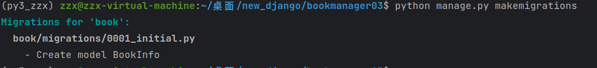

## 配置新的Django项目(包含模板)
#### 创建新的Django项目：

* 1、进入虚拟环境

'workon py3_zzx'

'django-admin startprojiect bookmanager02'

* 2、创建子应用

#### 在pycharm中配置Django项目配置虚拟环境(路径)

* 1、配置子应用

* 2、配置视图

* 3、配置子应用url

* 4、配置主应用url

#### 连接数据库

* 1、mysql建表

* 2、settings.py配置数据库

* 3、安装MYSQL发行库

'sudo apt-get install libmysqlclient-dev'

* 4、安装mysqlclient

'pip install mysqlclient'

#### 需要添加的类

* 1、例如：属性名 = models.类型(选项)

CharField字符串类型
DataField字符串类型
IntegerField整型
BooleanField布尔类型
DateField日期类型
DateTimeField日期时间类型
decimal 钱的类型
max_length 最大长度
unique 是否唯一
null 是否可以为空

* 2、表的选项

class Meta: 固定写法，改变表名

* 3、建表makemigrations

* 4、生成表migrate

* 5、定义人物信息，defauilt 定义默认值，定义有序字典，用于choices选择字典

#### 外键参考

* 1、定义外键'book_id = models.ForeignKey(BookInfo, on_delete=models.CASCADE)'

'on_delete=models.CASCADE' 级联删除

##### 每次改Model都需要makemigrations和migrate

* 1、更改表之后可以在数据库查询到数据

* 2、插入数据
'insert into bookinfo(name, pub_date, readcount,commentcount, is_delete) values
('射雕英雄传', '1980-5-1', 12, 34, 0),
('天龙八部', '1986-7-24', 36, 40, 0),
('笑傲江湖', '1995-12-24', 20, 80, 0),
('雪山飞狐', '1987-11-11', 58, 24, 0);'

* 3、查询数据
'select * from bookinfo;'

*4、插入人物数据

'insert into peopleinfo(name, gender, book_id, description, is_delete)  values
    ('郭靖', 1, 1, '降龙十八掌', 0),
    ('黄蓉', 0, 1, '打狗棍法', 0),
    ('黄药师', 1, 1, '弹指神通', 0),
    ('欧阳锋', 1, 1, '蛤蟆功', 0),
    ('梅超风', 0, 1, '九阴白骨爪', 0),
    ('乔峰', 1, 2, '降龙十八掌', 0),
    ('段誉', 1, 2, '六脉神剑', 0),
    ('虚竹', 1, 2, '天山六阳掌', 0),
    ('王语嫣', 0, 2, '神仙姐姐', 0),
    ('令狐冲', 1, 3, '独孤九剑', 0),
    ('任盈盈', 0, 3, '弹琴', 0),
    ('岳不群', 1, 3, '华山剑法', 0),
    ('东方不败', 0, 3, '葵花宝典', 0),
    ('胡斐', 1, 4, '胡家刀法', 0),
    ('苗若兰', 0, 4, '黄衣', 0),
    ('程灵素', 0, 4, '医术', 0),
    ('袁紫衣', 0, 4, '六合拳', 0);'

* 5、查询人物数据

* 6、shell实现 python manage.py shell

* 7、改写return str(self.name)方法

* 8、在shell中查询数据（实现增删改查）
用from book.models import BookInfo 导入模型类
BookInfo.objects.all()查询所有书籍信息

