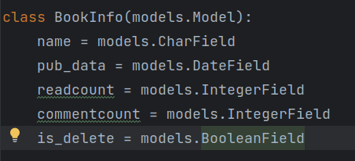
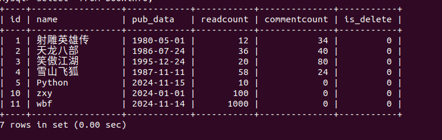

## 配置新的Django项目(包含模板)
#### 创建新的Django项目：

* 1、进入虚拟环境

'workon py3_zzx'

'django-admin startprojiect bookmanager02'

* 2、创建子应用

#### 在pycharm中配置Django项目配置虚拟环境(路径)

* 1、配置子应用

* 2、配置视图

* 3、配置子应用url

* 4、配置主应用url

#### 连接数据库

* 1、mysql建表

* 2、settings.py配置数据库

* 3、安装MYSQL发行库

'sudo apt-get install libmysqlclient-dev'

* 4、安装mysqlclient

'pip install mysqlclient'

#### 需要添加的类

* 1、例如：属性名 = models.类型(选项)

CharField字符串类型
DataField字符串类型
IntegerField整型
BooleanField布尔类型
DateField日期类型
DateTimeField日期时间类型
decimal 钱的类型
max_length 最大长度
unique 是否唯一
null 是否可以为空

* 2、表的选项

class Meta: 固定写法，改变表名

* 3、建表makemigrations

* 4、生成表migrate

* 5、定义人物信息，defauilt 定义默认值，定义有序字典，用于choices选择字典

#### 外键参考

* 1、定义外键'book_id = models.ForeignKey(BookInfo, on_delete=models.CASCADE)'

'on_delete=models.CASCADE' 级联删除

##### 每次改Model都需要makemigrations和migrate

* 1、更改表之后可以在数据库查询到数据

* 2、插入数据
'insert into bookinfo(name, pub_date, readcount,commentcount, is_delete) values
('射雕英雄传', '1980-5-1', 12, 34, 0),
('天龙八部', '1986-7-24', 36, 40, 0),
('笑傲江湖', '1995-12-24', 20, 80, 0),
('雪山飞狐', '1987-11-11', 58, 24, 0);'

* 3、查询数据
'select * from bookinfo;'

*4、插入人物数据

'insert into peopleinfo(name, gender, book_id, description, is_delete)  values
    ('郭靖', 1, 1, '降龙十八掌', 0),
    ('黄蓉', 0, 1, '打狗棍法', 0),
    ('黄药师', 1, 1, '弹指神通', 0),
    ('欧阳锋', 1, 1, '蛤蟆功', 0),
    ('梅超风', 0, 1, '九阴白骨爪', 0),
    ('乔峰', 1, 2, '降龙十八掌', 0),
    ('段誉', 1, 2, '六脉神剑', 0),
    ('虚竹', 1, 2, '天山六阳掌', 0),
    ('王语嫣', 0, 2, '神仙姐姐', 0),
    ('令狐冲', 1, 3, '独孤九剑', 0),
    ('任盈盈', 0, 3, '弹琴', 0),
    ('岳不群', 1, 3, '华山剑法', 0),
    ('东方不败', 0, 3, '葵花宝典', 0),
    ('胡斐', 1, 4, '胡家刀法', 0),
    ('苗若兰', 0, 4, '黄衣', 0),
    ('程灵素', 0, 4, '医术', 0),
    ('袁紫衣', 0, 4, '六合拳', 0);'

* 5、查询人物数据

* 6、shell实现 python manage.py shell

* 7、改写return str(self.name)方法

* 8、在shell中查询数据（实现增删改查）
用from book.models import BookInfo 导入模型类
BookInfo.objects.all()查询所有书籍信息

python shell的作用很快的验证增删改查

增删改查，先在views.py中编写，然后到shell中运行

##### 增加数据

方法一：

from book.models import BookInfo
book = BookInfo(
    name='Django',
    pub_date='2024-11-15',
    readcount=100, # 阅读量
    commentcount=50, # 评论量
    is_delete=False # 是否删除
)
book.save() # 保存数据

book.name = 'Python' # 修改数据
book.save()

book.delete() # 删除数据

BookInfo.objects.filter(name='Python') # 查询数据

方法二：
objects.create()方法可以直接创建数据，不需要先实例化对象
BookInfo.objects.create(
    name='Flask',
    pub_date='2024-11-15',
    readcount=100,
)

##### 修改数据

方法一：

1、先查询数据
book = BookInfo.objects.get(id=11)
2、修改数据
book.name = 'zxy'
book.save()

方法二：

调用objects.filter()方法(过滤条件)，然后调用update()方法

BookInfo.objects.filter(id=11).upadte(name='wbf', pub_date='2024-11-14',readcount=1000)

##### 删除数据

方法一：
先获取数据
book = BookInfo.objects.get(id=5)
book.delete()

方法二：

BookInfo.objects.filter(id=5).delete()

##### 查询数据

加入异常处理
try:
    BookInfo.objects.get(id=11)
except BookInfo.DoesNotExist:
    print('数据不存在')

查询人物

from book.models import PeopleInfo
PeopleInfo.objects.all()

count()统计方法

PeopleInfo.objects.all().count()
BookInfo.objects.all().count()

过滤查询
类.objects.filter(属性名_运算符=值) N个结果
类.objects.exclude(属性名_运算符=值) N个结果
类.objects.get(属性名_运算符=值) 单一数据

查询编号为1的图书
1、BookInfo.objects.get(id=1)
2、BookInfo.objects.filter(id=1)

查询书名包含“湖”的图书 name__contains=..

1、BookInfo.objects.filter(name__contains='湖')

查询书名以“部”结尾的图书 name__endswith=..

1、BookInfo.objects.filter(name__endswith='部')

查询书名为空的图书 name__isnull=True

1、BookInfo.objects.filter(name__isnull=True)

查询编号为1，3，5的图书 id__in=[1,3,5]
mysql:select * from bookinfo where id in (1,3,5)

1、BookInfo.objects.filter(id__in=[1,3,5])

查询编号大于3的图书 id__gt=3

查询id不等于3的图书 exclude(id=3)

查询1980年发表的图书
BookInfo.objects.filter(pub_data__year=1980)

查询1980年1-1后发表的图书
BookInfo.objects.filter(pub_data__gte='1980-1-1')

##### F对象

from django.db.models import F

查询评论量大于阅读量的书籍
BookInfo.objects.filter(commentcount__gte=F('readcount'))

并且查询，阅读量大于20，且编号小于3的图书
BookInfo.objects.filter(readcount__gt=20).filter(id__lte=3)

或者查询
查询阅读量大于20或编号小于3的图书
from django.db.models import Q
BookInfo.objects.filter(Q(readcount__gt=20) | Q(id__lte=3))

##### 聚合函数
from django.db.models import AVG, Max, Min, Sum
BookInfo.objects.aggregate(sum('readcount'))

阅读量排序
select * from bookinfo order by readcount

降序
select * from bookinfo order by readcount desc

BookInfo.objects.all().order_by('-readcount')

##### 关联查询
查询书id为1的图书的所有人物信息

from book.models import BookInfo, PeopleInfo
book = BookInfo.objects.get(id=1)
book.peopleinfo_set.all()

查询BookInfo下的peopleinfo_set外键字段

查询人物id为1的图书信息,因为models里有外键字段，所以可以直接查询

from book.models import BookInfo, PeopleInfo
person = PeoplesInfo.objects.get(id=1)
person.book.name
person.book.pub_data
person.book.readcount

##### 多对多关系
用QuerySet实现多对多关系

查询图书，要求图书人物为“郭靖”

查询图书，要求图书中人物的描述包含“八”

